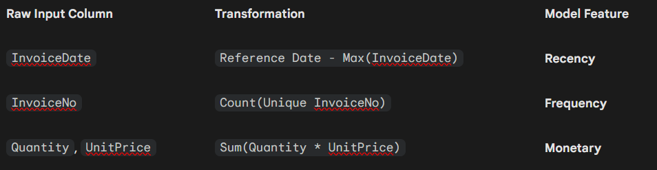

# 🛒 RFM Customer Intelligence Dashboard

## 📌 Project Overview

This project is a Machine Learning application designed to identify High-Value Customers for an online retail business.

Unlike a product recommendation system (which suggests items), this system evaluates the customers themselves. It uses RFM Analysis (Recency, Frequency, Monetary) to classify users into two groups:

Target (High Value): Customers likely to spend above the median monetary value.

Ignore (Low Value): Customers who are unlikely to generate significant revenue.

The goal is to help marketing teams focus their budget on the users most likely to respond profitably.

## 🚀 Key Features

**1. ⚡ Instant Predictor (What-If Analysis)**

A manual interface where users can adjust sliders for Recency, Frequency, and Monetary value.

Instantly outputs a "Recommendation Score" (Probability) using the trained model.

Visualizes the likelihood using a gauge chart.

**2. 📂 Batch Processor (Automated Feature Engineering)**

Allows users to upload raw transaction data (e.g., Online-Retail.xlsx).

Automated Pipeline: The app automatically:

Cleans the data (removes returns/nulls).

Groups transactions by Customer ID.

Calculates RFM metrics from raw columns (InvoiceDate, Quantity, UnitPrice).

Export: Generates a downloadable CSV list of high-value customers.

🛠️ Tech Stack

Language: Python 3.9+

Machine Learning: CatBoost Classifier

Web Framework: Streamlit

Data Processing: Pandas, NumPy

Visualization: Plotly Express

## 📊 How It Works

**1. The RFM Concept**

The model is trained on three key behavioral metrics derived from transaction history:

Recency (R): Days since the last purchase. (Lower = Better)

Frequency (F): Total number of unique transactions. (Higher = Better)

Monetary (M): Total money spent (Quantity * UnitPrice). (Higher = Better)

**2. The Model Logic**

Algorithm: CatBoostClassifier (Gradient Boosting).

Target Variable: The model was trained to predict 1 if a customer's total spend is above the dataset median, and 0 otherwise.

Input: The model strictly accepts [Recency, Frequency, Monetary] as inputs.

**3. Data Transformation Pipeline**

When uploading raw data in the Batch Processor tab, the app performs the following transformation before prediction:

